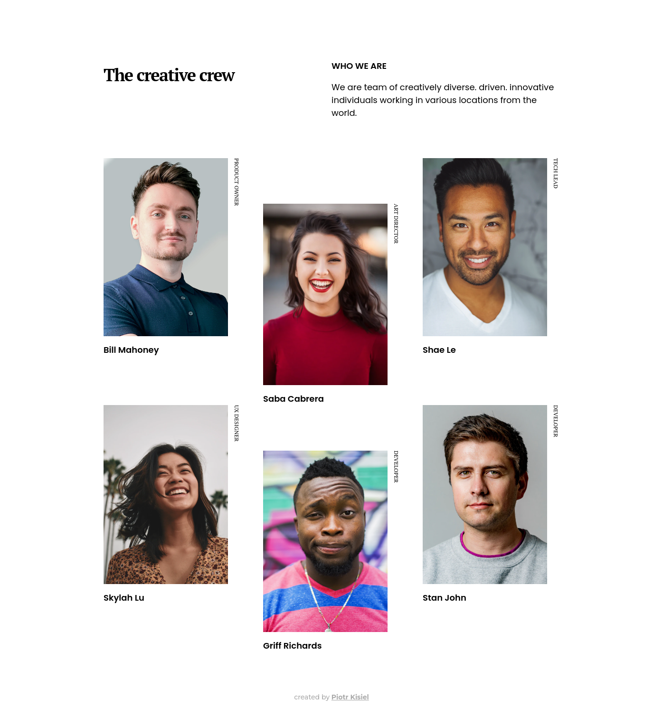
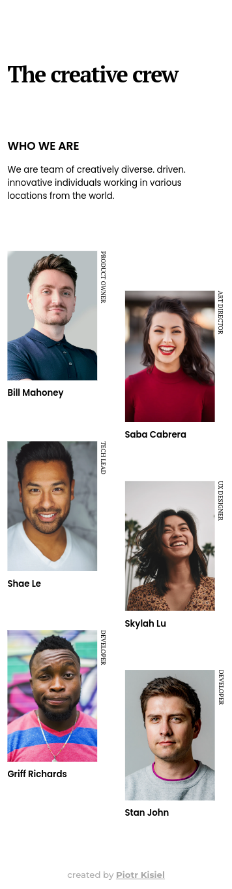

<!-- Please update value in the {}  -->

<h1 align="center">My team page</h1>

   Solution for a challenge from  <a href="http://devchallenges.io" target="_blank">Devchallenges.io</a>.

  <h3>
    <a href="https://pietyr.github.io/my-team-page/">
      Demo
    </a>
     | 
    <a href="https://github.com/pietyr/my-team-page">
      Solution
    </a>
     | 
    <a href="https://devchallenges.io/challenges/hhmesazsqgKXrTkYkt0U">
      Challenge
    </a>
  </h3>

<!-- TABLE OF CONTENTS -->

## Table of Contents

-   [Overview](#overview)
    -   [Desktop view](#desktop-view)
    -   [Mobile view](#mobile-view)
    -   [Built With](#built-with)
-   [Features](#features)
-   [Contact](#contact)

<!-- OVERVIEW -->

## Overview

### Desktop view

### Mobile view

### Built With

<!-- This section should list any major frameworks that you built your project using. Here are a few examples.-->

-   HTML
-   CSS

## Features

<!-- List the features of your application or follow the template. Don't share the figma file here :) -->

This application/site was created as a submission to a [DevChallenges](https://devchallenges.io/challenges) challenge. The [challenge](https://devchallenges.io/challenges/hhmesazsqgKXrTkYkt0U) was to build an application to complete the given user stories.

## Contact

-   GitHub [@pietyr](https://github.com/pietyr)
